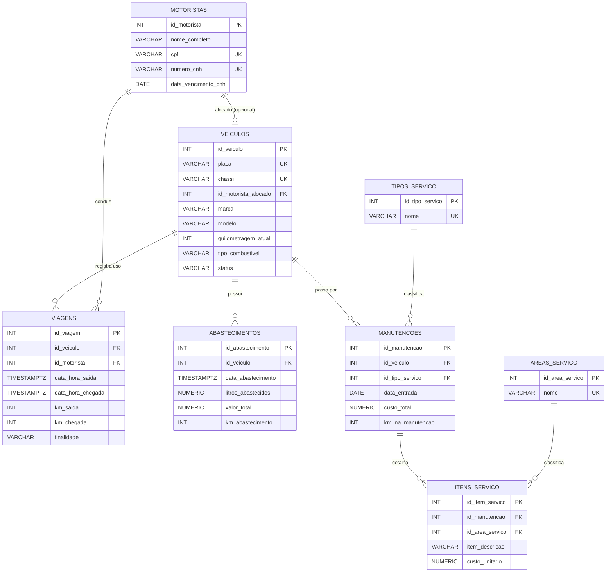

# Diagrama ER – Sistema de Gestão de Frotas

```mermaid
erDiagram
    VEICULOS ||--o{ VIAGENS : "registra uso"
    MOTORISTAS ||--o{ VIAGENS : "conduz"
    VEICULOS ||--o{ ABASTECIMENTOS : "possui"
    VEICULOS ||--o{ MANUTENCOES : "passa por"
    MANUTENCOES ||--o{ ITENS_SERVICO : "detalha"
    TIPOS_SERVICO ||--o{ MANUTENCOES : "classifica"
    AREAS_SERVICO ||--o{ ITENS_SERVICO : "classifica"
    MOTORISTAS ||--o| VEICULOS : "alocado (opcional)"

    VEICULOS {
        INT id_veiculo PK
        VARCHAR placa UK
        VARCHAR chassi UK
        INT id_motorista_alocado FK
        VARCHAR marca
        VARCHAR modelo
        INT quilometragem_atual
        VARCHAR tipo_combustivel
        VARCHAR status
    }

    MOTORISTAS {
        INT id_motorista PK
        VARCHAR nome_completo
        VARCHAR cpf UK
        VARCHAR numero_cnh UK
        DATE data_vencimento_cnh
    }

    VIAGENS {
        INT id_viagem PK
        INT id_veiculo FK
        INT id_motorista FK
        TIMESTAMPTZ data_hora_saida
        TIMESTAMPTZ data_hora_chegada
        INT km_saida
        INT km_chegada
        VARCHAR finalidade
    }

    ABASTECIMENTOS {
        INT id_abastecimento PK
        INT id_veiculo FK
        TIMESTAMPTZ data_abastecimento
        NUMERIC litros_abastecidos
        NUMERIC valor_total
        INT km_abastecimento
    }

    MANUTENCOES {
        INT id_manutencao PK
        INT id_veiculo FK
        INT id_tipo_servico FK
        DATE data_entrada
        NUMERIC custo_total
        INT km_na_manutencao
    }

    ITENS_SERVICO {
        INT id_item_servico PK
        INT id_manutencao FK
        INT id_area_servico FK
        VARCHAR item_descricao
        NUMERIC custo_unitario
    }

    TIPOS_SERVICO {
        INT id_tipo_servico PK
        VARCHAR nome UK
    }

    AREAS_SERVICO {
        INT id_area_servico PK
        VARCHAR nome UK
    }
```
