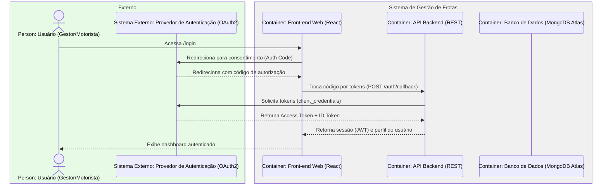
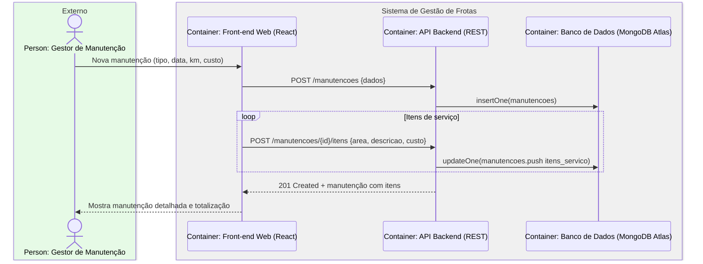

# Diagramas de Sequência (estilo C4) — Sistema de Gestão de Frotas

> Notação C4-like: **Person**, **Container**, **Sistema Externo** agrupados com `box`. Os nomes dos participantes indicam o tipo C4.

---

## 1) Autenticação (OAuth2/JWT)



---

## 2) Registrar Abastecimento & Calcular KM/L

```mermaid
sequenceDiagram
    box rgb(230,250,230) Externo
      actor U as Person: Gestor de Frota
    end
    box rgb(240,240,240) Sistema de Gestão de Frotas
      participant FE as Container: Front-end Web (React)
      participant API as Container: API Backend (REST)
      participant DB as Container: Banco de Dados (MongoDB Atlas)
      participant JOB as Container: Job de Agregações/Alertas
    end

    U->>FE: Abre formulário de novo abastecimento
    FE->>API: POST /abastecimentos {idVeiculo, litros, valor, km}
    API->>DB: insertOne(abastecimentos)
    API->>DB: findOne(ultimo abastecimento anterior do veículo)
    DB-->>API: {kmAnterior}
    API->>API: Calcula KM Rodado = kmAtual - kmAnterior; KM/L = KM Rodado / litros
    API->>DB: updateOne(veiculos.set quilometragem_atual)
    API-->>FE: 201 Created + métricas (KM Rodado, KM/L)
    FE-->>U: Mostra sucesso e atualiza dashboard

    alt KM regressivo ou dados inválidos
      API-->>FE: 422 Unprocessable Entity ("KM menor que o último")
      FE-->>U: Exibe erro de validação
    end

    par Agregações assíncronas
      API-->>JOB: Enfileira tarefa de recalcular médias
      JOB->>DB: Atualiza coleções de métricas/visões
    end
```

---

## 3) Iniciar/Encerrar Viagem & Regras de Negócio

```mermaid
sequenceDiagram
    box rgb(230,250,230) Externo
      actor M as Person: Motorista
    end
    box rgb(240,240,240) Sistema de Gestão de Frotas
      participant FE as Container: Front-end Mobile/Web
      participant API as Container: API Backend (REST)
      participant DB as Container: Banco de Dados (MongoDB Atlas)
    end

    Note over M,FE: Início de Viagem
    M->>FE: Informar saída (data/hora, km_saida)
    FE->>API: POST /viagens {idVeiculo, idMotorista, saida, km_saida}
    API->>DB: Verifica CNH válida do motorista
    API->>DB: Verifica status do veículo (Disponível)
    API->>DB: Verifica sobreposição de período para o veículo
    alt Regras OK
      DB-->>API: OK
      API->>DB: insertOne(viagens)
      API-->>FE: 201 Created (viagem iniciada)
      FE-->>M: Viagem ativa
    else Violação de regra
      API-->>FE: 409/422 (ex.: CNH vencida / sobreposição)
      FE-->>M: Exibe motivo do bloqueio
    end

    Note over M,FE: Encerramento de Viagem
    M->>FE: Informar chegada (data/hora, km_chegada)
    FE->>API: PATCH /viagens/{id}/encerrar {chegada, km_chegada}
    API->>DB: Valida chegada >= saída e km_chegada >= km_saida
    API->>API: Calcula KM Rodado; atualiza métricas
    API->>DB: updateOne(viagens); updateOne(veiculos.set quilometragem_atual)
    API-->>FE: 200 OK + resumo (KM Rodado)
    FE-->>M: Exibe confirmação
```

---

## 4) Manutenção com Itens de Serviço (resumo)


